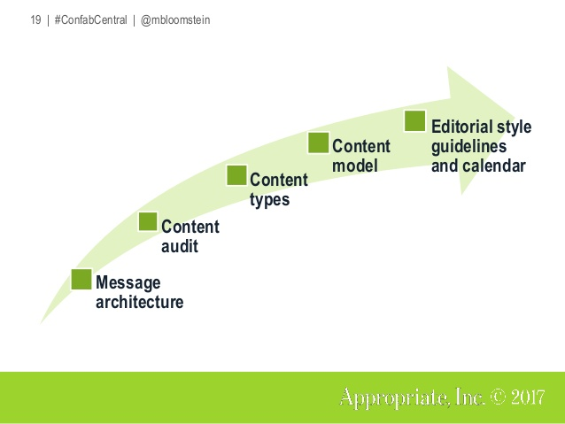

# Message architecture - content audit - content types: Three building blocks of a brand driven content strategy.

A brand-driven content strategy helps an organization to figure out its values and differentiators. It shapes the path for all future content decisions.

Boston-based content strategist Margot Bloomstein has developed, practiced and reflected on *brand driven content strategy* as a specific approach to content strategy over a long period of time. In this lecture she presented and discussed the basics of her approach with a lot of  examples from her own practice.

<figure>
<caption>In her inimitable, always positive manner, Margot Bloomstein took the students by the hand, spoke about her own experiences and taught along the way how a brand driven content strategy can solve business problems.
</caption>
</figure>

Towards the end of the 90ies user orientation became an important motto in web development and web design (although often not in the practice of companies). User orientation is often understood as the most important guideline in content strategy. But if an organization is communicating only to meet user needs its business value becomes unrecogonizeable and its brand becomes generic. The course “Brand Values & Message Architecture” focuses on the role and the needs of brands and on ways to solve brand related challenges through content strategy.

The lecturer Margot Bloomstein is a passionate content strategist with more than 20 years of experience in the field. She has developed her own method to create a brand driven content strategy. Brand driven content strategy is the lense through which she looks at content strategy. “It is not the only one, but it is one right way”, Bloomstein explains.

Margot Bloomsteing understands the development of a brand driven content strategy as a 5 step process. The three fist steps are:

- the elaboration of a message architecture
- a brand oriented content audit
- the definition of the most appropriate content types.

## Message architecture: the translation of brand values into communication goals

The message architecture is the organizing principle of a brand oriented content strategy. By precisely carving out a message architecture an organization can define actionable communication objectives based on what is most important and valuable to it. A message architecture does not consist of the brand's values themselves. It is a guide for external communication. It sets the direction of how an organization should communicate with its audience to get its message across. “A message architecture is a hierarchy of communication goals; as a hierarchy, they're attributes that appear in order of priority, typically in an outline.” (Bloomstein, 2012, S.20) Since all businesses and organizations are dealing with constraints, such as limited time or budget, the message architecture represents the most important communication goals in a prioritized order.

As an example Margot Bloomstein showed the message architecture of a medical laboratory:

- Passionate about strategic discovery
    - creative, spirited, inspired
    - Visionary, innovative thought leader and industry leader
    - Flexible
- Tactical and hands-on
    - In the trenches, in touch
    - Detail-oriented and methodical
- Pioneering
    - Groundbreaking, trend-setting
    - Modern and savvy
- People-focused and market-driven
    - Trusted by medical professionals, researchers and media
    - Industry news source

#### Message architecture in practice [#](#message-architecture-in-practice)

Margot Bloomstein showcased many real-life examples of how message architecture works in practice. She sparked up a discussion by asking which of these drinks contain the most caffeine:

None of the students in class would have guessed the correct answer: **Starbucks coffee**. Why? Bloomstein explains that the messaging shapes the character of a brand and how it is perceived. While Starbucks speaks more to professionals in suits, Red Bull focuses on the athlete type of consumer. The latter makes you believe that the drink gives you more energy, although that is in fact not true.

#### How to define a message architecture: introduction to the card sorting exercise [#](#how-to-define-a-message-architecture-introduction-to-the-card-sorting-exercise)e

Margot Bloomstein's preferred tool for developing a message architecture is a sorting exercise with a a stack of brand cards. The stack consists of cards with around 100 possible brand attributes. Each attribute is printed on one card. The participants assign the cards to 3 different columns:

*   who we are not
*   who we are
*   who we’d like to be

When all cards have been assigned to one of the columns, the pile of cards in the who-we-are-not-column gets tossed away. In a second round the participants try to discover the 3 or so most important attributes of their organization together with some accompanying or specifying secondary attributes. They have to decide what values (attributes) they want to leave behind - in most cases a difficult decision. But it is crucial to arrive at a small number of specific messages -  otherwise it is impossible to use the messages for deciding what to communicate and what not. The identity of the organization would not be sufficiently defined. All attributes the participants want to keep, go into the pile of who we’d like to be. In the last step, the participants have to group similar attributes in word clouds and prioritize those clouds. The result is a hierarchy of attributes that represent an organization's communication goals.

**Annotation** Card sorting is also used in information architecture e.g. for defining navigation menus for a website.

The physical interaction with the cards puts more weight on the terms selected. It also encourages a conversation around topics and concepts. During the whole process, the contento strategist takes over the role of a consultant and facilitator. She/he steps back to shows the group that it is their task and responsibility to do the work. In the end, the deliverables are merely the result of the work of the client.  

#### Where do we go from there? [#](#where-do-we-go-from-there)

The message architecture is also the foundation for a qualitative content audit. What content do we already have and is it any good? Does it align with the message architecture and the communication goals?

#### What is a content audit? [#](#what-is-a-content-audit)

The opportunity to start a content strategy from scratch is mostly not given, so the (future) content strategist has to look up carefully what’s already there when he or she is going to guide a company through the jungle of the theoretical part of the content - before even writing the first word of the copy or collecting the pictures.

A content audit has proven its worth here. In order to determine what should be continued, what is superfluous, and what is missing, the current state of the media used must of course be determined. As there are different ways to audit content - all types have the preceding reason in common: A goal, a specific question, the message architecture - everything is a possible reason why or what is being measured. It does not make sense to perform an audit 'just because'.  

#### How to conduct a qualitative content audit [#](#how-to-conduct-a-qualitative-content-audit)

Initially, the quantity of the existing content is being gathered. For example: For a website content audit, a list of all the URLs can be put in a large spreadsheet (there are tools to do that). Next, the different content types should be examined. Are there a lot of PDFs on the web page? Are there many images (which is good)? Videos? Where are links set or is there double content? Are there dead links?

After this rough overview the quality of the content can be determined. This works in several ways. The same table can be used and evaluated against the goals, the question or the priorities of the message architecture that has been determined before. But one can also make a customer journey through the current website and check if the needs are met, if the questions are answered.

Doing the content audit is also dealing with restrictions - you need to figure out how to deal with constraints. Should you do only a strategic sample of the website? Which one is best to choose?

In order to set the right steps for a content strategy, this is one of the core deliveries to the client. At least the qualitative content audit helps to make recommendations for further content decisions.

In the class, Margot Bloomstein provides several different ‘doings’ to get her students to the topic. ‘Hands-on’ and ‘speak up’ is the overriding principle in each of her lectures.

Based on the content audit it is possible to recommend appropriate content types.  

#### What is a content type? [#](#what-is-a-content-type)

In his online glossary for web content management [Deane Barker](https://flyingsquirrelbook.com/author/) defines a content type as follows: “The specification of a logical type of content–for example, a News Article or a Blog Post.” A content type can be seen as declaration of a specific piece of content that contains information. Many business owners, CEO’s or even marketers are tempted to think that a simple video makes great content. In truth, it is still the message itself that decides between good or bad content. A video is just the packaging in which the message is being wrapped in. Therefore it is crucial to select content types which support specific communication goals.

#### How to recommend appropriate content types [#](#how-to-recommend-appropriate-content-types)

After having conducted the audit the content strategist can recommend content types that fit the needs of the client. The selected content types represent the communication goals of the business, organization or company. Here is an example: If the communication goal is to be perceived as engaged and fun, is an annual report the right channel? Or is it a blog, games and videos? In other words, the choice of content types and channels manifest any communication goals that have been defined in the message architecture.

#### Finding content types: Let the Hunger Games begin [#](#finding-content-types-let-the-hunger-games-begin)

In class each of the 29 students had to recommend one or two content types based on the audit they conducted before. The challenge was that none of the recommended content types should be repeated. The question at the time was: Are there enough content types for everyone?

Here is an excerpt from the ideas that the students presented (with a special thanks to Tamara Schiffer, COS20 student, for collecting the content types throughout the session):  

*   Social Media Wall

*   Wizard for Covid19 Help

*   Infographic

*   Videos

*   Webinars with Q&A

*   Case Studies

*   FAQ and Guides for customer support

*   Quiz

*   Travel blog

*   Checklist

*   Notification

*   Pricing-range for the shops listed

The mention of the Hunger Games in the headline is just a little joke from the authors because it turned out there was enough for everyone. When speaking of content types, one first thinks of video, images and long copy. But content types can be found in every corner. CoSchedule, a marketing organization software, published [113 content type ideas](https://coschedule.com/blog/types-of-content/), many of those are not immediately thought of such as quotes or references. Furthermore this list also shows clearly that suitable content types can also be found for smaller budgets. The latter has to be considered by the content strategist when recommending content types to the client. Because in the process of aligning the content types with the message architecture internal resources like budget or personnel can get shifted and reallocated.

According to Bloomstein many (content) challenges can be tackled with these 3 steps: creating a message architecture, conducting an audit and recommending appropriate content types and channels. Deeper insights on Content modeling and editorial guidelines will be taught in specific lectures throughout the master degree of Content Strategy at FH Joanneum Graz.  

> It has been really valuable that Margot shared her industry knowledge and helped us to apply them to our projects. I have already seen the positive results of her lectures in my professional life.

– Omer Sarica, COS20-Student

> The Brand Values class provided me with a very practical approach to creating brand-driven content strategies. Starting with the messaging architecture creation exercise, the content audit and the final assignment (which brought everything together), this class equipped me with a solid foundation. The class prompted students to think about problem solving for business goals and user needs through the lens of communication goals and story-telling, using a logical step-by-step approach. Additionally, I particularly liked the instructor’s proactive approach to encouraging student participation. It sparked some very interesting discussions around the topic.

– Azza El Arabi, COS20-Student

Literature & Ressources:

Appropriate, Inc., Margot Bloomstein [https://appropriateinc.com/](https://appropriateinc.com/)

Barker, D. (2021, January 5). _Web Content Management. Glossary._ [https://flyingsquirrelbook.com...](https://flyingsquirrelbook.com/glossary/)

Bloomstein, M. (2012). Content strategy at work: Real-world stories to strengthen every interactive project. Morgan Kaufmann.  

