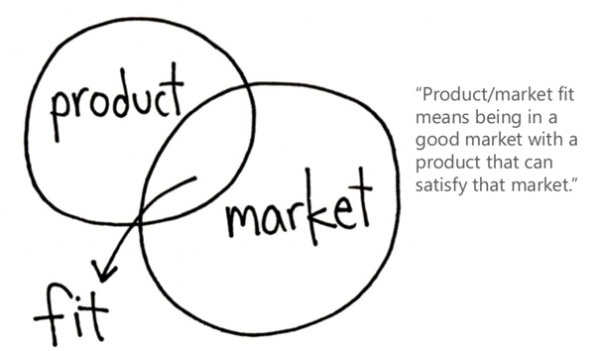

# Startup Metrics

## Teaser

Knowledge is power. To recognize success, a company must effectively measure and know where it stands in the market and what its long-term investments and goals are. Measuring with the appropriate metrics will help a company to make the right decisions for its short and long-term goals.

## Course

"Stakeholder Analysis and Digital Business" taught by Dieter Rappold in the first Semester of the Master's degree course "Content Strategy" October and November 2020

## Relevance

Startups are focused on very rapid growth. Successful startups are experimental and data-driven, and their metrics are closely related to the metrics for measuring the success of content. Startups and digital content live in the same digital ecosystems.

This lecture provides an introduction to startup metrics from the perspective of a digital entrepreneur, investor and consultant.

## Teacher

Dieter Rappold

## Description

### The data driven approach

> “If you cannot measure it, you cannot improve it”

To define your organisation’s success, you need to define the metrics you will be using. A metric gives meaning to measurement, and to find the right metrics you need to know what supports your company best. There is no one-size-fits-all-solution: Which metrics you chose depends on what business you support, and, speaking of content, which business problem you want to solve via content. Many successful organizations have developed their own, highly specific metrics. A lot of them are open and can be analyzed and compared via services like [Baremetrics](https://baremetrics.com/ "Baremetrics: Subscription Analytics & Insights for Stripe, Braintree, Recurly & more!").

> “A data-based decision-making culture is the single most important competitive edge of start-ups against incumbents. But most startups are in love with their product and rather work on a “Product founder fit “ than a “Product-market fit"."

– Dieter Rappold, Founder, and CEO of Speedinvest Pirates

There are different main types of metrics. Often they are classified by the categories:

*   Quality
*   Quantity
*   Efficiency

Proven metrics for start-ups, which can be used for a customized metrics strategy, are:

1.  [Customer Acquisition Cost](https://neilpatel.com/blog/customer-acquisition-cost/ "Customer Acquisition Cost: The One Metric That Can Determine Your Company’s Fate")[^patel2021] (CAC)
2.  [Retention](https://blog.hubspot.com/service/customer-retention-metrics "10 Customer Retention Metrics & How to Measure Them")[^smith]
3.  [Customer Churn Rate](https://www.retentionscience.com/blog/why-measuring-your-customer-churn-rate-increases-revenue/ "Customer Churn Rate: Definition, Measuring Churn and Increasing Revenue | ReSci")[^churn]
4.  [Customer Lifetime Value](https://doi.org/10.1002/(SICI)1520-6653(199824)12:1<17::AID-DIR3>3.0.CO;2-K "Customer lifetime value: Marketing models and applications, Paul D.Berger and  Nada I.Nasr")[^berger] (LTV)
5.  [Product Metabolism](https://venturefizz.com/stories/boston/why-product-metabolism-every-startup-s-first-kpi "Why Product Metabolism Is Every Startup’s First KPI | VentureFizz")[^dolginow]
6.  [Viral coefficient](https://andrewchen.co/viral-coefficient-what-it-does-and-does-not-measure/ "Viral coefficient: What it does and does NOT measure at andrewchen")[^chen]

The key question is: **When to apply which metrics?** To answer this question, it is crucial to differentiate between the different metrics, like input and output metrics. Output metrics reflect the results, and input metrics indicate actions. Above all, before you start you should base your decision on your data.

### What to achieve by Metrics? Product Market Fit (PMF) as a condition for Sustainable Growth

The [Product/Market Fit](https://web.stanford.edu/class/ee204/ProductMarketFit.html "EE204 Business Management for Engineers and Computer Scientists")[^andreesen] (PMF) is no metric but it should guide a start-up's analytics efforts as soon as product specific information from the market can be gathered. The Product/market fit is the degree to which a product satisfies strong market demand. Measuring the Product/market fit is the first step for a company to gather feedback from the market and to evaluate the customers' interest in a specific products. The Product-Market Fit can be considered as one of the main orientation points of a start-up's successful work.

**To focus on the PMF metric helps us in:**

*   Respecting fundamentals such as a sustainable business model
*   Striving for long-term profitability (and not growth at all cost)
*   Showing how revenue ultimately surpasses costs (rather than making money straight away)

**The cons of the MFP metric are manageable but still relevant:**

*   It is unclear what to track, when, and how
*   Lack of focus on product-market fit

### Find your personal North Star Metric (NSM)

Whatever you are doing - you need a metric which gives you an orientation for all of your business, often called a [North Star Metric](https://growwithward.com/north-star-metric/ "What is your North Star Metric? + 8 steps to find your NSM immediately. 2019, November 4. Ward van Gasteren")[^van_gasteren]. It measure's your overall company success. Just as the North Star is needed to align the entire coordinate system of the sky, the North Star metric provides a reference point for all other metrics, and thus for all of an organization's actions.

Using the NSM Metric means finding the one metric that matters and your one metric that best captures the core value of the product and it also reflects your PMF. The NSM will often be an amalgam of several metrics. Since it should measures the overall quality of your endeavour it will be an output metric.

A North Star Metric is essential if a company wants to reach its maximum growth potential. To grow in long term, a company will need to develop a long-term growth strategy and for that, the ‘North Star Metric’ should be in this stratgy's center.

When defining your NSM the company needs to be aware that “revenue” is a bad choice. Revenue is what the customer pays in return for the product. To measure the sustainability of your project a north star metric is focused on the value the product brings to people. Having revenue as an NSM means the company doesn’t have a clear long-term strategy.

The key reason, why a Company should have a North Star Metric or in other words the **pros:**

* **Orientation:** the NSM gives more orientation to the company itself, the core business, and the products which are sold
* **Core Value:** NSM captures the core value of the business and the company.
* **Focus:** The NSM provides a clear focus, and everyone has the same goal.
* **Clarity:** It is clear to everyone how and what the company is doing on a short- and long-term basis
* **Customer focus:** the first concern is bringing value to the customer
* **Growth:** efficient long-term growth as the company is more focused on value

### The AARRR funnel - a proven combination of metrics

Did you hear about the [AARRR](https://medium.com/@ms.mbalke/aarrr-framework-metrics-that-let-your-startup-sound-like-a-pirate-ship-e91d4082994b "Balke, M. 2019, May 6. AARRR Framework-Metrics That Let Your StartUp Sound Like A Pirate Ship. Medium.")[^balke] funnel? It’s all about Acquisition, Activation, Retention, Referral, and Revenue.

The first A stands for *Acquisition*. At his stage of the funnel on organization has to find out where the customers are coming from and where there is enough space for the company to grow. A well known acquisition metric is *conversion rate* (CR): the percentage of visitors who perform a certain desired action.

The next A stands for Activation and is related to the client's personal first experience with the product. It depends on how customers feel about a product and the company behind it before they consume or use the product. At this stage metrics indicate the value of your product and how willing customers are to use and ultimately pay for it.

A well known activation metric is CAC – *Customer Acquisition Cost*. CAC shows the costs of convincing a potential customer to buy a product. This can be organic or paid. The difference can be explained by an example: When you go into a shop in town and buy something, this purchase is an organic acquisition for the shop. However, if you have been targeted by a flyer or other advertising, then it is a paid acquisition.

Let’s move on to the R which stands for *Retention*: It indicates the quality of growth. And that means how many customers who have bought from the company once come back and how often. Often a differentiation is made here between:

* DAU = Daily Active Users
* WAU = weekly active users
* MAU = monthly active users

In digital sales, these figures are particularly important. Various marketing campaigns try to push the numbers up and to boost sales. Good retention metrics inform about the quality of growth, eg about the percentage of daily users who become monthly unsers.

The second R stands for *Referral Metrics* and expresses the willingness of customers to recommend a product to their peers. These metrics depend on definitions of e.g. customer loyality. Loyal customers, who always buy from the same company, the same brand, and/or the same product, are one of the most important assets for a company. Power users, brand lovers and super followers are especially loyal customers. To find out which value is decisive for them is important to estimate the Product Market Fit.

*Revenue Metrics* show last but not least how to increase revenue and how the company can push up sales figures and profits respectively. An important metric in this section of the funnel ist the *Customer Lifetime Value* (CLTV). The CLTV shows the net profit from one customer over the whole span of time he or she is in a connection with a company. If you are one of the brand lovers or super followers of a company, then you will be treated accordingly and can enjoy some goodies. However, if you're more like a casual shopper, then you're not going to get the benefits. For this reason, loyal customers are always more important to companies than new customers. Finding new customers is easier than finding loyal ones - similar to friendships!

It optimizes the business journey and set up some valuable and actionable metric goals for a company and especially for start-ups. For long-term growth, a start-up needs to have an attribution model, a bidding model, to know where the customers are coming from, and which measures to take. The Attribution model means to know better which of your spending is doing great and which not. The retention metrics show a company where new growth is possible. In saturated markets, it is hard to get new customers and to increase sales. For that, it is important to know, where market growth is possible and where new customers can be fetched.

Not only for start-ups the AARRR is important. Also, long-existing companies should have a look at the five most important metrics, because those metrics effectively measure the company’s growth and are at the same time simple and actionable.

## Presentation

<dieterrappold_cos20_ws2020_metricslecture.pdf>

## Where to go from here

Startup metrics are a part of business analytics. The borders between business analytics and web and social media analytics are open. Many concepts and methods are used for both. Often, especially when content marketing is at stake, web and social media analytics *is* business analytics.

In our master's program elements of this introductory lecture will be used in the courses on web and social media analytics and content marketing.

## Recommended Reading

The Austrian company [Speedinvest Pirates](https://www.speedinvest-pirates.com/ "Home | Speedinvest Pirates") (disclosure: our lecturer Dieter Rappold ist on of its founders) offers a short and succinct guide to startup metrics for free: [The ultimate guide to startup metrics](https://get.speedinvest-pirates.com/metrics-guide/ "Download Page for 'The ultimate guide to startup metrics'")[^weinmayr]

Neil Patel, one of the most interesting and prolific authors in this field, gives an overview about some of the most important startup metrics in his blogpost  [9 Metrics to Help You Make Wise Decisions about Your Start-Up](https://neilpatel.com/blog/9-metrics/ "Neil Patel: 9 Metrics to Help You Make Wise Decisions about Your Start-Up")[^patel2011]

Find more literature regarding some of the mentioned topics in the references! We have tried to find one important post or paper for each of the mysterious acronyms in the text.

## References

[^andreesen]: Andreesen, M. (2007, June 25). Product/Market Fit [University Course]. Stanford University: EE204 Business Management for Engineers and Computer. https://web.stanford.edu/class/ee204/ProductMarketFit.html

[^balke]: Balke, M. (2017, November 26). AARRR Framework- Metrics That Let Your StartUp Sound Like A Pirate Ship. Melanie Balke on Medium. https://medium.com/@ms.mbalke/aarrr-framework-metrics-that-let-your-startup-sound-like-a-pirate-ship-e91d4082994b

[^berger]: Berger, P. D., & Nasr, N. I. (1998). Customer lifetime value: Marketing models and applications. JOURNAL OF INTERACTIVE MARKETING, 12(1), 14. https://doi.org/10.1002/(SICI)1520-6653(199824)12:1<17::AID-DIR3>3.0.CO;2-K

[^chen]: Chen, A. (2008, April 18). Viral coefficient: What it does and does NOT measure [Personal Website]. /@andrewchen. https://andrewchen.co/viral-coefficient-what-it-does-and-does-not-measure/

[^churn]: Customer Churn Rate: Definition, Measuring Churn and Increasing Revenue. (2014, October 30). Retention Science. https://www.retentionscience.com/blog/why-measuring-your-customer-churn-rate-increases-revenue/

[^dolginow]: Dolginow, D. (2011, April 27). Why Product Metabolism Is Every Startup’s First KPI. VentureFizz. https://venturefizz.com/stories/boston/why-product-metabolism-every-startup-s-first-kpi

[^patel2011]: Patel, N. (2011, October 19). 9 Metrics to Help You Make Wise Decisions about Your Start-Up. Neil Patel. https://neilpatel.com/blog/9-metrics/

[^patel2021]: Patel, N. (2021, March 2). Customer Acquisition Cost: The One Metric That Can Determine Your Company’s Fate [Personal Website]. Neil Patel. http://neilpatel.com/blog/customer-acquisition-cost/

[^smith]: Smith, O. (n.d.). 10 Customer Retention Metrics & How to Measure Them [Company Website]. Hubspot. Retrieved 5 March 2021, from https://blog.hubspot.com/service/customer-retention-metrics

[^van_gasteren]: van Gasteren, W. (2021, February 4). What is your ‘North Star Metric’? + 8 steps to find your NSM immediately. Grow with Ward. https://growwithward.com/north-star-metric/

[^weinmayr]: Weinmayr, J. (Ed.). (2020). The ultimate guide to startup metrics. Speedinvest Pirates. https://get.speedinvest-pirates.com/metrics-guide/
