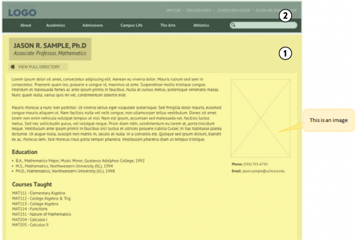

# Wireframes and the implementation of a CMS

## Topics

## course

Introduction to Content Management

## Teachers

## Teaser

Following the process of a wireframe analysis, this lecture report touches on some of the basic questions, concepts and insights presented in Deane Barker’s class “Introduction to Content Management”.

## Relevance

Wireframes are visualisations of the elements which a website should have. They are one of the typical artifacts used during the implementation of a content management system. They are conceived e.g. by designers and content strategists. Together with annotations they inform the implementors of a content management system what should be realised. But it depends on the content management system and its customisation whether and how this realisation is possible.

In this report we use the analysis of a wireframe to introduce some key concepts of content management as explained by Deane Barker in his course and his writings. If content strategists and designers understand how the content objects and aggregations that a wireframe depicts are realised by a CMS, they understand the affordances and the limitations that CMSes impose on their work.

## Description

Wireframes show different elements on a screen visually and functionally. During the development of a website they are often used to show what is going to be built into a Content Management System (CMS). Due to their versatility, they can be used in different fields like designing or developing for different reasons. Mostly there is one wireframe built for each content type.

### What is a wireframe?

Wireframes are not just arrangements of text and pictures, so-called screen mockups. They focus on what a screen does, not what it looks like. They are showing graphically what is going to be built in the CMS, so each party involved will be on the same page and know what is going to be developed.

A Content Management System is a

> software system which automates the tasks around the management of content. A CMS assists editors in creating, organizing, controlling, securing, and ultimately delivering content. [@barkerWebContentManagement]

<!-- Replaced the definition of CMS. They don't necessarily need a database. -->

Wireframes usually show the core content of a page (the *content object*), and  additional information assembled around the content object like categories, navigational information etc.e.

### How is a wireframe used?

Wireframes are used differently by different people, depending on their respective roles in a web project. Many *designers* use wireframes for the visual design of user interfaces. *Developers* use them to understand functionalities and get an idea of the technical requirements needed. An *analyst* uses wireframes to show e.g. business rules. Wireframes visualize desired interaction and/or navigational paths. They serve to understand the functionality and the user interface of the screen-based end-product on the screen.

In his lecture Deane Barker showed us some good examples for wireframes. They can be easily understood when you’ve visited a bunch of websites:
“1. A department subsite menu with a bunch of resources specific to that department explicitly placed in a hierarchy. 2. A blog with a group of blog posts ordered from latest to oldest. 3. A topic page about something with a bunch of disparate resources all related to that topic in order 4. of relevance as determined by a content retrieval algorithm. 5. A set of “related content” links under an article. 6. A list of the “Latest News” headlines on the home page.”

– https://gadgetopia.com/post/8069/

When wireframes are used as base for the implementation of a CMS the annotations play a crucial role.They must contain the informations the implementators need. Every bit of functionality which is not related to content items must be described. Examples are the behaviour of images or the working of a search box. Questions have to be answered for every piece of content shown in the wireframes. Many of these questions concern the content objects, that means the content which is usually adressed by a URL: Blogposts, Staff biographies etc. Another set of questions regards the content assembled around these content objects. This content and the content object itself form what Deane Barker calls *aggregations* of content.  

### Content objects and content types #

Usually the same wireframe type is used for instances of the same [content type](https://flyingsquirrelbook.com/glossary/term/content-type/ "Term: "Content Type"") (like e.g. blogpost, news article, web shop entry) U

<!-- misunderstanding of content types. Was: Usually there is one wireframe for each content type like text, image, video etc. -->

So, having discussed the framework, let us go into the details of what content is displayed where and how it ends up there. Before taking a closer look at the Operative Content Object, we will descend in the hierarchy of things, examine how the content we are seeing on the page is put in, modeled and presented.

But even before that, let us get to the core of the matter and clarify:

What is content? #

When looking at our wireframe of the page, and looking at our Operative Content Object, we see what appears to be a CV of a staff member, consisting of a name, a sub-line with title and department, the text, an image, some contact information and two lists listing the education and the courses taught.

Assuming that this is our content is true, but not of full accuracy: what we see is the assembly of content that has been modeled and rendered into this actual visible form.

The page displayed in our OCO is the rendering of a defined model of what a staff member page should consist of (and look like) that has been created in the CMS. This is an example of a content type. It could be called “staff member page”. All parts of that page (the name, title, department and so forth) are modeled content shown in its representations as well. These are the content attributes that are bundled in the content type.

Thus, the content itself, before modeled and represented, is data in raw form, that “comes to live” when transformed for the channels it is displayed in. Other than a website in our example, these can be social media posts, a PDF, an E-Mail, a text-message or physical media.

The raw data (that becomes the content) is put into the CMS by the editors.
Types and models #

The content model defines what content types there are available, what attributes these types consist of, what datatype each attribute consists of (e.g. text, date, digit, email-adress, …) and which validations are used to secure that the right kind of data is inputted for each attribute.

So in our example, the content type could consist of these attributes:

● the name (that requests the datatype text and could be validated with an required input),

● the title (which should be kept optional in validation, and an edited list could be provided to choose from),

● the position (datatype: text or chosen from edited list provided, validation: required)

● the subject (datatype: text or chosen from edited list provided, validation: required)

● body text (datatype: text, validation: required)

● subheadline ‘education’ (datatype: chosen from edited list provided, validation: required)

● subheadline ‘courses taught (datatype: chosen from edited list provided, validation: required)

● portrait image (datatypes: jpg/png, validation: image format, size)

There are four more content objects on the page that are attributes in the content type, but that could draw their data not from the input provided by the editor but could be pulling the data from the organisation’s data base for example:

● list ‘education’

● list ‘courses taught’

● Email-adress

● Telephone number
We are surrounded #

Having explained the Operative Content Model our wireframe has been built for to evaluate and design, let’s have a brief look on what else can be seen.

### Aggregations

The surround, as introduced above, consists of a logo and two sets of menus.

When we look at a menu – and let’s focus on the main menu here – we see the names of sections (About, Academics, Admissions…), BUT – beyond the surface of information architecture, in the depths of content management – we are also looking at some sort of representation of the content structure. Menus are not the content itself, but are references to the content, and often are - unless “hardcoded” ­– a content aggregation. Dependent on the shape of content, aggregations can be put to use for generating a site’s navigation.

Content comes in different shapes. The most common three ones are serial, hierarchical and tabular. Serial content is organized – guess what – in a serial matter, and ordered by a parameter. Hierarchical content is organized into a tree, and content objects have an ancestral relation to each other. Tabular content is organized in a grid or “table” as we know it from spreadsheets.

So how content is organized within an CMS also determines the possibilities it can be displayed and represented in the chosen output channel. So an information designer and a person setting up a CMS will be looking at the same page from two very different angles.

### Wireframes and the limits of a CMS

Basically a wireframe is made of the [Operative Content Object](https://flyingsquirrelbook.com/glossary/term/operative-content-object/ "Term: 'Operative Content Object'") and its surrounding that consists for example of a header, footer or sidebar (see a wireframe example image 1: yellow area (1) marks the Operative Content Object, green area (2) marks the surrounding).

Wireframe2 zones 01
“Once you’ve designed the basic layout (wireframe; note) for your article, you can load up the sidebars with all sorts of fun stuff – related links, today’s weather, promotional widgets for all sorts of stuff, etc.”

– https://gadgetopia.com/post/7114/

A common problem can be that most Content Management Systems have functions - like managing and displaying - for the Operative Content Object itself but not for the surrounding. The surrounding is related to the OCO through links for example but a direct association can be missing. You could solve this problem contextually:

“This means that each piece of content “lives” in some larger construct. It belongs to a “category” ... or some other grouping that enables you to abstract the Surround away. So, you have some logical construct to which both (1) OCO, and (2) the surround gets assigned. This is where those two “meet” and are associated with each other.”

– https://gadgetopia.com/post/7114/

If you look at each piece of information in the surrounding and assign it to a bigger context you will get a wireframe with a solid basis. After you’ve created the wireframe you can start to plan your project.

## Where to go from here

A lot of folks have had some experience with Content Management Systems or at least think they have a rough idea of what they are about. By doing this short run-through of a wireframe analysis we touched some of the core concepts and opened a couple of doors to the world of managing content. But these are only glimpses. Dean Barker’s lectures enter the depths of it’s modelling, aggregating, implementing, templating and migrating, aswell as editorial workflows and aquisition. And they are just an introduction.

### Recommended reading

[Introduction to Content Management: Course Syllabus](https://deanebarker.net/intro-to-cms/ "Introduction to Content Management: Course Syllabus")

### References

    Barker, Deane. 2012. „The Art and Practice of Content Assembly: Where IA and CMS Meet“. Https://Gadgetopia.Com/. Abgerufen 25. November 2020 (https://gadgetopia.com/post/8069/).

    Barker, Deane. 2010. „The Problem of Context“. Https://Gadgetopia.Com/. Abgerufen 25. November 2020 (https://gadgetopia.com/post/7114/).

    O A. o. J. „Understanding Wireframes! - Business Analyst Training Online“. Abgerufen 25. November 2020 (http://myprojectanalysis.com/index.php/business-analysis/item/295-understanding-wireframes).
